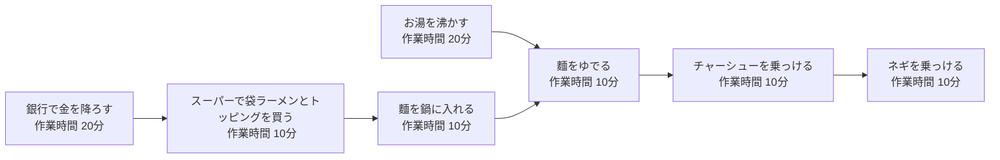

```mermaid
flowchart LR
    id1["銀行で金を降ろす
    作業時間 20分"]
    id2["スーパーで袋ラーメンとトッピングを買う
    作業時間 10分"]
    id3["麵を鍋に入れる
    作業時間 10分"]
    id4["お湯を沸かす
    作業時間 20分"]
    id5["麵をゆでる
    作業時間 10分"]
    id6["チャーシューを乗っける
    作業時間 10分"]
    id7["ネギを乗っける
    作業時間 10分"]
    id1 --> id2
    id2 --> id3
    id4 --> id5
    id5 --> id6
    id6 --> id7
    id3 --> id5
```