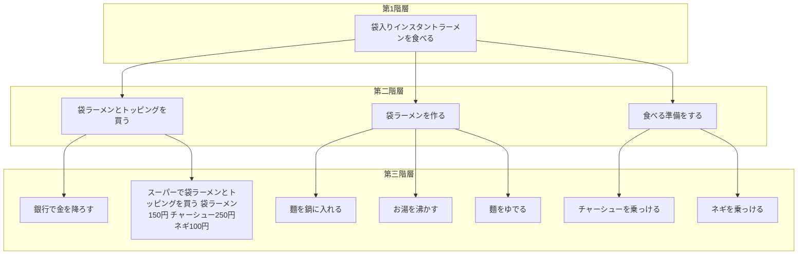

```mermaid
flowchart TD
    subgraph "第1階層"
    id1["袋入りインスタントラーメンを食べる"]
    end
    subgraph "第二階層"
    id2["袋ラーメンとトッピングを買う"]
    id3["袋ラーメンを作る"]
    id4["食べる準備をする"]
    end
    subgraph "第三階層"
    id5["銀行で金を降ろす"]
    id6["スーパーで袋ラーメンとトッピングを買う 袋ラーメン150円 チャーシュー250円ネギ100円"]
    id7["麵を鍋に入れる"]
    id8["お湯を沸かす"]
    id9["麵をゆでる"]
    id10["チャーシューを乗っける"]
    id11["ネギを乗っける"]
    end
    id1-->id2
    id1-->id3
    id1-->id4
    id2-->id5
    id2-->id6
    id3-->id7
    id3-->id8
    id3-->id9
    id4-->id10
    id4-->id11
```