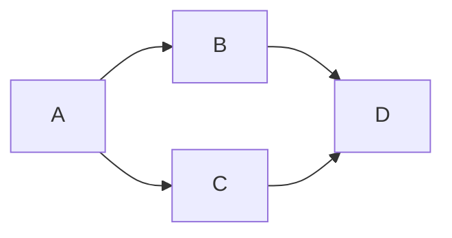
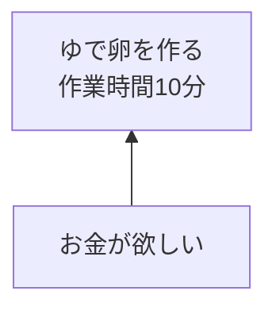
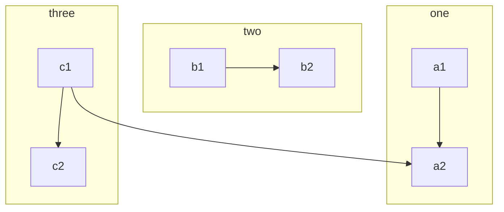
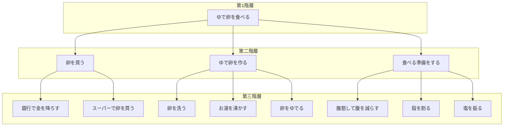

```mermaid
graph LR;
    A-->B;
    A-->C;
    B-->D;
    C-->D;
```

```mermaid
graph BT
    id1["お金が欲しい"]
    id2["ゆで卵を作る
    作業時間10分"]
    id1-->id2
```

```mermaid
flowchart TB
    c1-->a2
    subgraph one
    a1-->a2
    end
    subgraph two
    b1-->b2
    end
    subgraph three
    c1-->c2
    end
```

```mermaid
flowchart TD
    subgraph "第1階層"
    id1["ゆで卵を食べる"]
    end
    subgraph "第二階層"
    id2["卵を買う"]
    id3["ゆで卵を作る"]
    id4["食べる準備をする"]
    end
    subgraph "第三階層"
    id5["銀行で金を降ろす"]
    id6["スーパーで卵を買う"]
    id7["卵を洗う"]
    id8["お湯を沸かす"]
    id9["卵をゆでる"]
    id10["腹筋して腹を減らす"]
    id11["殻を割る"]
    id12["塩を振る"]
    end
    id1-->id2
    id1-->id3
    id1-->id4
    id2-->id5
    id2-->id6
    id3-->id7
    id3-->id8
    id3-->id9
    id4-->id10
    id4-->id11
    id4-->id12
```
